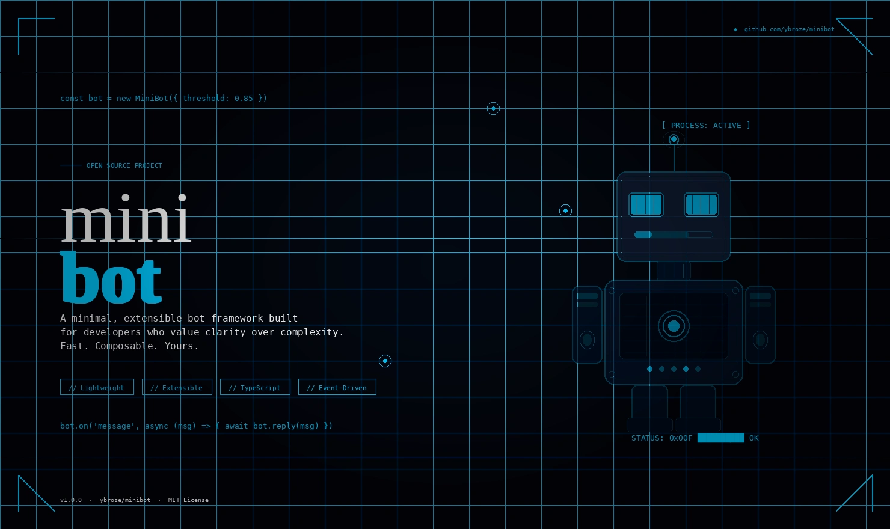

<p align="center">
  
</p>

# Minibot

Scripts and configuration for running an isolated AI agent environment on
dedicated macOS hardware (Apple Silicon Mac Mini). Three user accounts provide
defense-in-depth: an **admin** user for system setup, a **minibot** user for
Docker containers and secrets, and an **ollama** user that runs the local LLM
in isolation. All networking is locked to localhost.

## User Accounts

| User | Purpose | Has access to |
|------|---------|---------------|
| **admin** | System setup, Homebrew, user creation | Everything (sudo) |
| **minibot** | Docker containers, secrets, agent infrastructure | Keychain, Docker socket, `~/minibot/` |
| **ollama** | Local LLM server only | Ollama binary, `~/.ollama/models/` |

The `minibot` and `ollama` users are standard (non-admin) accounts. They cannot
`sudo`, install software, or access each other's home directories. The `ollama`
user has no access to secrets, Docker, or any minibot data.

## Setup

### 1. Harden the Machine (as admin)

These steps secure the base system before anything else. Do them once.

- **System Update:** Software Update to macOS Tahoe (26.x) or later.
- **FileVault:** System Settings > Privacy & Security > FileVault > Turn On.
  Save the recovery key in a password manager.
- **Firewall:** System Settings > Network > Firewall > Turn On.
- **Advanced Data Protection:** System Settings > Apple ID > iCloud > Advanced Data Protection > Turn On.
- **Remote Login (SSH):** System Settings > General > Sharing > Remote Login > On.
  Required for headless operation — after reboot with FileVault, you unlock
  the disk remotely via SSH pre-boot prompt using the admin password.

> **CRITICAL:** Without FileVault, anyone with physical access can read all
> data by booting into recovery mode. Save the recovery key.

### 2. Install Dependencies and Create Users (as admin)

```bash
cd ~/Downloads
git clone https://github.com/ybroze/minibot.git
bash minibot/scripts/admin-setup.sh
```

This installs Xcode CLI Tools, Homebrew, Docker Desktop, Tailscale, Ollama,
CLI debug tools, creates both the `minibot` and `ollama` user accounts, and
configures energy settings for 24/7 headless operation. Each step is
idempotent.

<details>
<summary>Manual alternative</summary>

```bash
xcode-select --install
/bin/bash -c "$(curl -fsSL https://raw.githubusercontent.com/Homebrew/install/HEAD/install.sh)"
echo 'eval "$(/opt/homebrew/bin/brew shellenv)"' >> ~/.zprofile
eval "$(/opt/homebrew/bin/brew shellenv)"
brew install --cask docker tailscale
brew install libpq redis mongosh ollama
```

</details>

After installing, complete the GUI-only steps **(still as admin)**:

- Open Docker Desktop (`open -a Docker`), accept the license, enable
  "Start Docker Desktop when you sign in" (this is per-user — repeat as
  `minibot` in step 5).
- Open Tailscale, log in, approve the system extension and VPN prompts.

### 3. Set Up Remote Access (as admin)

**Tailscale** provides the network layer. Install it on any device you want
remote access from and log in with the same account. Verify with
`tailscale status` — all devices should appear with `100.x.x.x` addresses.

**Screen Sharing** provides graphical remote desktop over Tailscale. Enable it
on the minibot machine: System Settings > General > Sharing > Screen Sharing >
On. From another Mac on your tailnet, connect via Finder > Go > Connect to
Server > `vnc://<tailscale-ip>`, or open Screen Sharing.app directly.

### 4. Set Up the `ollama` User (as ollama)

Log in as the `ollama` user (via Screen Sharing or SSH). This user runs
**only** the local LLM server — nothing else.

```bash
cd ~/Downloads
git clone https://github.com/ybroze/minibot.git
bash minibot/scripts/install-ollama-user.sh
```

This installs a LaunchAgent that runs `ollama serve` on login, then pulls
the Llama 3.1 8B model (~4.9 GB download). The `ollama` user has no access
to secrets, Docker, or any minibot data.

After setup, you can log out of the `ollama` user. Ollama will start
automatically on future logins via the LaunchAgent.

### 5. Configure the `minibot` User (as minibot)

Log in as `minibot`. If `admin-setup.sh` created the account, the password
was set during admin setup. Optionally harden the account:

- Disable iCloud sync: System Settings > Apple ID > iCloud > Turn off all
- Disable Siri: System Settings > Siri & Spotlight > off
- Disable Location Services: System Settings > Privacy & Security > off

### 6. Install Minibot (as minibot)

Docker Desktop must be running. Open it if needed, wait for the whale icon to
settle, and enable "Start Docker Desktop when you sign in."

```bash
cd ~/Downloads
git clone https://github.com/ybroze/minibot.git
bash minibot/install.sh
source ~/.zshrc
```

The installer creates directories, copies scripts, configures the shell,
prompts for secrets (stored in the macOS Keychain), builds the `openclaw:local`
Docker image from source, verifies Ollama is running (managed by the `ollama`
user), and installs LaunchAgents.

All secrets (`POSTGRES_PASSWORD`, `REDIS_PASSWORD`, `MONGO_PASSWORD`,
`OPENCLAW_GATEWAY_PASSWORD`) live in the macOS Keychain and are managed through
`mb-secrets`. OpenClaw manages its own internal secrets (API keys, bot tokens)
separately.

### 7. Configure API Spending Limits (as minibot)

Before starting services, set spending limits on each external API provider's
dashboard. For each key: set daily/monthly caps, enable alerts at 50% and 80%,
and prefer prepaid billing where available. API keys are managed by OpenClaw
internally, not through `mb-secrets`.

### 8. Start Services (as minibot)

```bash
mb-start        # Load secrets from Keychain, start containers
mb-status       # Check container status
mb-logs         # Follow live logs
mb-llm-status   # Verify Ollama is running (under the ollama user)
```

#### Resource Limits (16 GB Mac Mini)

| Service    | Container/Process      | Memory | CPUs | User |
|------------|------------------------|--------|------|------|
| PostgreSQL | minibot-postgres       | 1 GB   | 1.0  | minibot |
| Redis      | minibot-redis          | 256 MB | 0.5  | minibot |
| MongoDB    | minibot-mongo          | 1 GB   | 1.0  | minibot |
| OpenClaw   | minibot-openclaw       | 4 GB   | 2.0  | minibot |
| Ollama     | native (Metal GPU)     | ~4.9 GB | all | ollama |
| **Total**  |                        | **~11.5 GB** | | |

macOS + Remote Desktop use ~3-4 GB on a headless machine, leaving ~1.5-2.5 GB
headroom.

### 9. Enable 24/7 Operation

Three LaunchAgents across two users handle auto-start on login:

| LaunchAgent | User | Purpose |
|-------------|------|---------|
| `com.minibot.gateway` | minibot | Starts Docker services |
| `com.minibot.caffeinate` | minibot | Prevents system sleep |
| `com.ollama.serve` | ollama | Runs `ollama serve` with KeepAlive |

Verify:

```bash
# As minibot:
launchctl list | grep minibot

# As ollama:
launchctl list | grep ollama
```

**With FileVault (recommended):** Auto-login is disabled by macOS. After each
reboot you must unlock the disk via SSH pre-boot prompt (admin password), then
start both user sessions via SSH or Screen Sharing. Once sessions start, all
LaunchAgents fire automatically.

**Without FileVault:** Auto-login is available for one user. Configure it for
the `ollama` user (System Settings > Users & Groups > Automatic login), then
log in as `minibot` manually after reboot.

Sleep prevention is handled by `admin-setup.sh` (`pmset` settings) plus the
caffeinate LaunchAgent (under `minibot`).

Test: `sudo reboot`, then verify with `mb-status` and `mb-llm-status`.

---

## Shell Aliases (minibot user)

Available after `source ~/.zshrc` in the `minibot` user's shell:

| Alias | Description |
|-------|-------------|
| `mb-start` | Load secrets, start all containers |
| `mb-stop` | Stop all containers |
| `mb-status` | Show container status |
| `mb-logs [service]` | Follow Docker logs |
| `mb-build` | Rebuild OpenClaw from source |
| `mb-secrets <cmd>` | Manage Keychain secrets (`init`, `list`, `set`, `get`) |
| `mb-health` | Run health check |
| `mb-audit` | Run security audit |
| `mb-llm-status` | Check Ollama status (runs under `ollama` user) |
| `mb-llm-info` | Show Ollama management info |

## Directory Structure

```
~/minibot/                  (minibot user's home)
├── bin/                    # Operational scripts (start, stop, logs, secrets)
├── data/                   # Persistent data (700 permissions)
│   ├── postgres/, redis/, mongo/, openclaw/
│   └── logs/system/        # LaunchAgent logs
├── docker/                 # docker-compose.yml
├── scripts/                # Maintenance (backup, restore, health-check,
│                           #   security-audit, reset, LaunchAgents, etc.)
├── vendor/openclaw/        # OpenClaw source (created by mb-build)
├── docs/                   # Detailed documentation
└── zshrc-additions.sh      # Shell config (sourced by ~/.zshrc)

~ollama/                    (ollama user's home)
├── ollama-data/logs/       # Ollama LaunchAgent logs
└── .ollama/models/         # Downloaded model files (managed by Ollama)
```

## Documentation

| Topic | File |
|-------|------|
| Getting started | `GETTING_STARTED.md` |
| Threat model | `docs/THREAT-MODEL.md` |
| Secrets management | `docs/SECRETS.md` |
| Networking & ports | `docs/NETWORKING.md` |
| Maintenance & rotation | `docs/MAINTENANCE.md` |
| Emergency procedures | `docs/EMERGENCY.md` |
| Containerization security | `docs/SECURITY.md` |
| Filesystem security | `docs/FILESYSTEM.md` |

## Troubleshooting

**Docker not starting** — Run `open -a Docker` (as `minibot`), wait 30-60s for
the whale icon to settle, then `mb-start`.

**Secrets missing** — Run `mb-secrets init` then `mb-secrets list` to verify
(as `minibot`).

**OpenClaw won't start** — Check `docker image inspect openclaw:local` (run
`mb-build` if missing), then `mb-logs openclaw` for errors (as `minibot`).

**Ollama not running** — Log in as `ollama` and check:
`launchctl list | grep ollama`. If not loaded, re-run
`bash ~/Downloads/minibot/scripts/install-ollama-user.sh`.

**Database connection errors** — Check `docker logs minibot-postgres`,
verify `mb-secrets get POSTGRES_PASSWORD` returns a value (as `minibot`).

**Disk space** — `du -sh ~/minibot/data/*` and `docker system prune`
(as `minibot`).

---

## Environment Cleanup (optional)

For a dedicated machine, you can remove unused macOS apps (Music, TV,
FaceTime, Keynote, etc.) by dragging from `/Applications` to Trash.
SIP-protected apps can be ignored.

```bash
# As admin: disable Spotlight on data directory
sudo mdutil -i off ~/minibot/data

# As minibot: disable App Store auto-updates (also offered during install)
defaults write com.apple.commerce AutoUpdate -bool false
```
